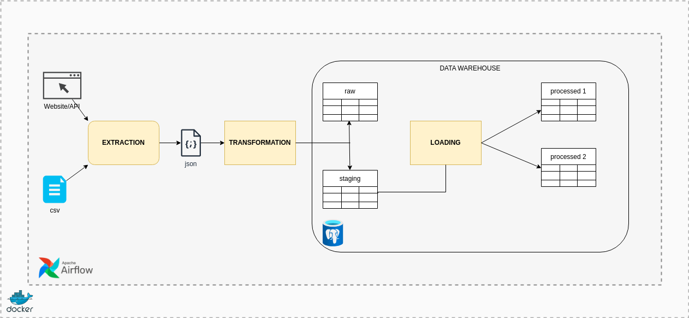

# HOME SOLAR PRODUCTION  WEBSCRAPPING + AIRFLOW

### MOTIVATION AND CHALLENGE
This project is an adaptation of Home Solar Panel Data webscrapping project and is not designed to be replicable.\
The overall challenge is to get the historical and current data from the home solar system without a proper API on daily basis. \
Getting the data was achieved in the first version of project but lacked the ability to run recurrently, to achieve this I had to learn how Docker works and set up an orchestration tool, which I did using Airflow. \
I will keep adding more features to make the project more robust and closer to real-world solutions.

This repository is a snippet of my Airflow enviroment, it contains the necessary files and folder structure for showcasing only.

### TOOLS
- Docker: For containerizing the applications environments bellow;  
- Airflow 2.9.3: Orchestrates the daily data retrieval tasks;  
- Postgres: Database for storing and managing the collected data and the metadata from Airflow;
- Selenium: Automates the web interaction required for data extraction

### FILE DESCRIPTIONS
The structure is designed to resemble a DW enviroment and focus on prioritizing execution recording. \
`json_files`: Directory stores the extracted json files as a landing zone;\
`hourly24_production_2024-08-15.json`: Json file sample; \
`missing_dates.csv`: This CSV file stores the dates that are missing from the `solar_raw` table, indicating the days that data was not collected; 

### HOW IT WORKS
The DAG is scheduled to run every day at 9pm as this is when the day's energy data is completed collected by the microinverter; \
Each task calls for a python module for specific purposes:
1. `missing_json`: Scans the `solar_raw` table for the latest json file input and generates the csv listing missing dates;
2. `extraction_json`: Logs into the website, and navigates to the page that enables the API and extracts the current date (or more missing dates if needed)  and then stores the json file temporarily  in the landing repository;
3. `loading_json`: Loads the json file content to a staging table in Postgres;
4. `transforming`: Perform the necessary transformations in staging areas so it can be loaded into the final tables avoiding duplicate inserts. The staging tables are truncated and the json repo is cleared;

### WORKFLOW AND ARCHITETURE

### DATA

**RAW LAYER**\
`solar_raw` contains the filename and json content;

**PROCESSED LAYER**\
`summary_processed` contains the day's summary\
`[prod_date]` date of production;\
`[duration]` total of sunlight hours;\
`[max]` peak of energy in kwh;\
`[co2]` the equivalent amount of CO2 benefit the system has provided; 

`energy_processed` contains the hourly energy kwh 

