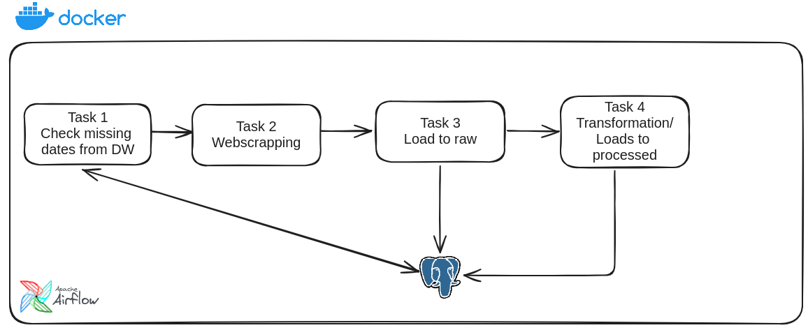
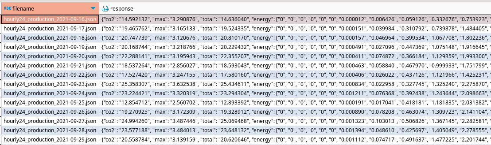
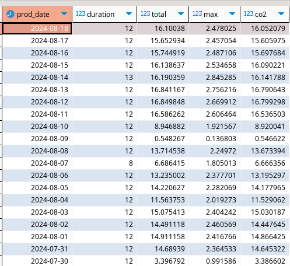
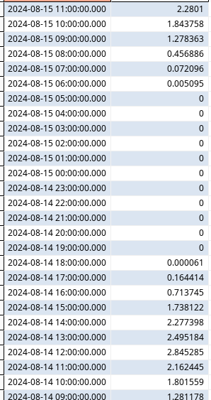

# HOME SOLAR PRODUCTION  WEBSCRAPPING + AIRFLOW

### MOTIVATION
This project is an adaptation of my first webscrapping project.\
The following challenge was to set it up using Airflow orchestration tool and apply new learnings.\
This repository is a snippet of my Airflow enviroment, it contains the necessary files and folder structure for showcasing only.

### TOOLS
- Docker  
- Airflow 2.9.3  
- Postgres
- Selenium

### FILE DESCRIPTIONS
`json_files`: This directory stores the extracted json files;\
`hourly24_production_2024-08-15.json`: Json file sample; \
`missing_dates.csv`: This CSV stores the dates between latest date found in DW raw table; \

### HOW IT WORKS
The DAG is scheduled to run everyday at 9pm because it will contain all the energy input of the microinverter for the day; \
Each task calls for a python module for the following purposes:
1. `missing_json`: Scans the `solar_raw` table for the latest json file input and generates the csv for the dates;
2. `extraction_json`: Login the website and navigate to specific page to enable the API and extracts the current date (or previous dates if needed) json file and saves to the json repository;
3. `loading_json`: Load the json file to a staging table in Postgres;
4. `Transforming`: Perform transformations and loads them to the staging tables, only to load them to the final tables to avoid duplicate inserts;

### WORKFLOW AND ARCHITETURE

### DATA

RAW layer: `solar_raw`

Processed layer: `summary_processed`

`energy_processed`

